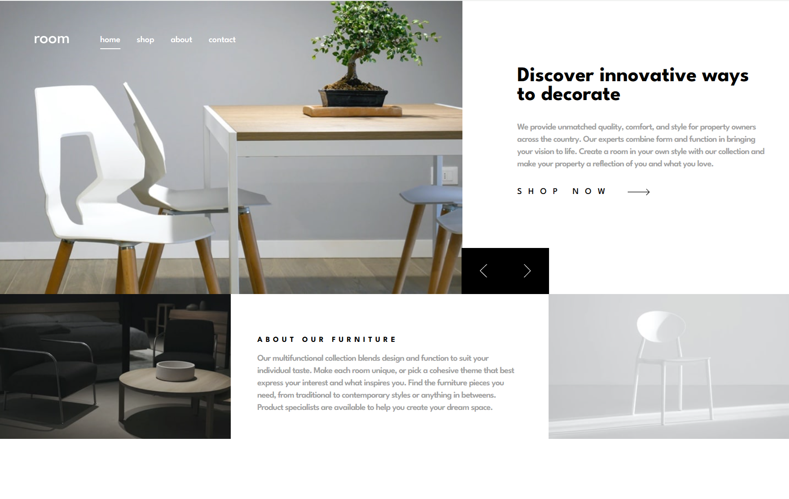
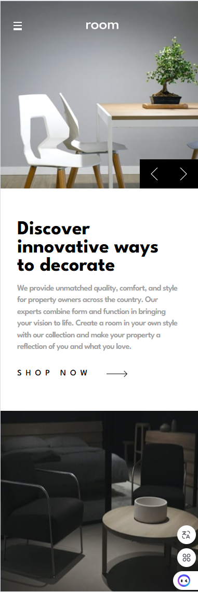
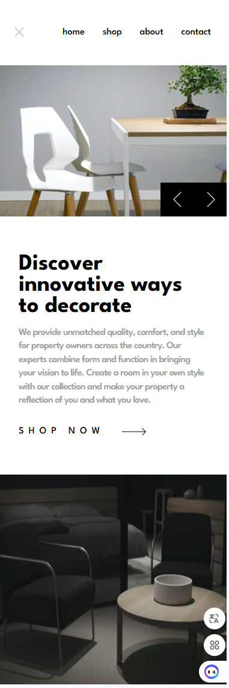

# Frontend Mentor - Room homepage solution

This is a solution to the [Room homepage challenge on Frontend Mentor](https://www.frontendmentor.io/challenges/room-homepage-BtdBY_ENq). Frontend Mentor challenges help you improve your coding skills by building realistic projects.

## Table of contents

- [Overview](#overview)
  - [The challenge](#the-challenge)
  - [Screenshot](#screenshot)
  - [Links](#links)
- [My process](#my-process)
  - [Built with](#built-with)
  - [What I learned](#what-i-learned)
  - [Useful resources](#useful-resources)

## Overview

### The challenge

Users should be able to:

- View the optimal layout for the site depending on their device's screen size
- See hover states for all interactive elements on the page
- Navigate the slider using either their mouse/trackpad or keyboard

### Screenshot





### Links

- Solution URL: [Add solution URL here](https://your-solution-url.com)
- Live Site URL: [Add live site URL here](https://your-live-site-url.com)

## My process

### Built with

- Semantic HTML5 markup
- CSS custom properties
- Flexbox
- CSS Grid
- Mobile-first workflow

### What I learned

I learned how to make animations and transitions.

To see how you can add code snippets, see below:

```html
<h1>Some HTML code I'm proud of</h1>
```

```css
.sliderLeft {
  cursor: pointer;
  transition: opacity 250ms;
}

.sliderRight {
  cursor: pointer;
  transition: opacity 250ms;
}

.sliderLeft:hover {
  opacity: 0.5;
}

.sliderRight:hover {
  opacity: 0.5;
}

@keyframes slide-in {
  from {
    transform: translateX(-100%);
  }
  to {
    transform: translateX(0);
  }
}

@keyframes slide-out {
  from {
    transform: translateX(100%);
  }
  to {
    transform: translateX(0);
  }
}
```

```js
function triggerAnimation(el, animationName) {
  if (!el) return;
  el.style.animation = "none";
  // forzar reflow para reiniciar la animación
  void el.offsetWidth;
  el.style.animation = `${animationName} 1s ease-in-out`;
  function clear() {
    el.style.animation = "";
    el.removeEventListener("animationend", clear);
  }
  el.addEventListener("animationend", clear);
}

sliderRight.addEventListener("click", () => {
  // Aumenta el índice, y si llega al final, vuelve al inicio
  currentSlide = (currentSlide + 1) % slides.length;

  // Actualiza el contenido
  heroTitle.textContent = slides[currentSlide].title;
  heroImg.style.backgroundImage = `url('../images/${slides[currentSlide].image}')`;
  heroText.textContent = slides[currentSlide].description;
  triggerAnimation(heroImg, "slide-in");
  triggerAnimation(heroTitle, "opacidad");
});

sliderLeft.addEventListener("click", () => {
  currentSlide = (currentSlide - 1) % slides.length;
  if (currentSlide < 0) {
    currentSlide = 2;
  }
  // Actualiza el contenido
  heroTitle.textContent = slides[currentSlide].title;
  heroImg.style.backgroundImage = `url('../images/${slides[currentSlide].image}')`;
  heroText.textContent = slides[currentSlide].description;
  triggerAnimation(heroImg, "slide-out");
  triggerAnimation(heroTitle, "opacidad");
});
```

### Useful resources

- [Example resource 1](https://design.penpot.app) - This helped me for design the html and css.
